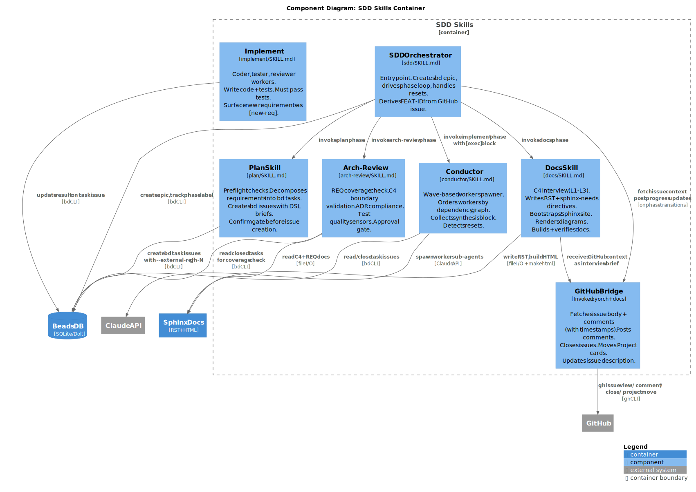

SDD Skills — Components
=======================

The SDD Skills container contains seven components. Each maps to a
``skills/<name>/SKILL.md`` that an LLM agent reads before acting.

Components
----------

SDD Orchestrator
~~~~~~~~~~~~~~~~

**Responsibility**: Entry point and pipeline state machine. Creates the bd
epic, reads the current ``phase=`` label, invokes the appropriate skill for
each phase, advances the label on success, and increments ``reset-count``
on resets.

**Patterns**: State machine over ``phase`` enum (docs → plan → implement →
arch-review → done). All state is externalised to the bd epic label — the
orchestrator is stateless between invocations.

**Owns**:

- The bd epic lifecycle (create, label updates, close).
- FEAT-ID derivation from GitHub issue title (kebab-slug, max 20 chars,
  shown to user for confirmation before the docs phase begins).
- Invocation routing: ``/sdd #N`` triggers GitHub Bridge fetch before docs;
  ``/sdd FEAT-XXX`` resumes from the current phase.
- Reset loop and escalation (surface pattern to user after 3+ resets).

**Does NOT**:

- Write RST, run tests, spawn coder workers, or read GitHub directly.
  Those responsibilities belong to the downstream skills.

**Interfaces**:

- Calls: GitHub Bridge (fetch + update), Docs Skill, Plan Skill, Conductor,
  Arch-Review, bd CLI.
- Returns: terminal report to developer on ``phase=done``.

---

GitHub Bridge
~~~~~~~~~~~~~

**Responsibility**: All reads from and writes to GitHub. Called by the
Orchestrator and the Docs Skill. Wraps ``gh`` CLI commands and surfaces
actionable errors when the CLI is not authenticated.

**Patterns**: Thin adapter — no business logic, no state. Translates
structured calls (fetch issue, post comment, close issue, move card) into
``gh`` CLI invocations. Formats the fetched issue + comments as a structured
brief for the Docs Skill:

.. code-block:: text

   # GitHub Issue #N: <title>
   Filed: <ISO date> by @<author>
   Body:
   <issue body>

   Comments:
   [<ISO date> @<author>] <comment text>
   [<ISO date> @<author>] <comment text>
   ...

**Owns**:

- Fetching issue body and comments (with author + timestamp).
- Posting the plan-approval comment with epic ID and task list.
- Updating the GitHub issue description after docs approval (appends a
  structured ``## SDD Spec`` section; does not overwrite human content).
- Closing the GitHub issue when ``phase=done``.
- Moving the GitHub Projects card: Backlog → In Progress (plan approval),
  In Progress → Done (pipeline done). Skips silently if no Projects board
  is linked.

**Does NOT**:

- Decide what to write in comments or the description update — that content
  is composed by the caller (Orchestrator or Docs Skill) and passed in.
- Manage GitHub labels on the issue itself (not in scope).

**Key interfaces**:

- ``fetch_issue(n) → brief_text``
- ``update_description(n, appended_section)``
- ``post_comment(n, body)``
- ``close_issue(n)``
- ``move_project_card(n, column)`` — no-op if no project linked.

---

Docs Skill
~~~~~~~~~~

**Responsibility**: Structured C4 interview and RST authoring. Receives the
GitHub brief from the Orchestrator (via GitHub Bridge) as its opening context
so it does not re-ask what is already in the issue. Writes architecture RST,
feature specs with ``feat`` / ``req`` directives, and ADRs. Bootstraps Sphinx
if ``docs/conf.py`` is absent. Renders diagrams and builds to verify.

**Patterns**: Conversational interviewer with a mandatory approval gate at the
end. One or two questions at a time. Fields already answered in GitHub are
skipped; the skill only fills gaps.

**Owns**:

- All files under ``docs/architecture/``, ``docs/specs/``, and
  ``docs/design_log/``.
- Requirement IDs (``REQ-XXX-NNN``) and their six required fields.
- The design log RST (``docs/source/design_log/FEAT-XXX-RRR.rst``) — written
  at the end of the docs interview, before the approval gate, tagged with all
  C4 element ids and requirement ids produced in the session.
- The design log index (``docs/source/design_log/index.rst``) — appended with
  each new entry.
- The approval gate — does not return ``approved`` until the user explicitly
  confirms.

**Does NOT**:

- Create bd task issues (that is Plan's job).
- Post to GitHub (that is GitHub Bridge's job).
- Feed design log content back into pipeline context — it is a reference
  artifact only.

---

Plan Skill
~~~~~~~~~~

**Responsibility**: Preflight checks, task decomposition, user confirmation
gate, and bd issue creation. Reads C4 L3 component narratives from Sphinx
to build fully-contextual task briefs. Creates bd issues with ``--external-ref
gh-N`` so every task is traceable back to the originating GitHub issue.

**Patterns**: Preflight → extract requirements → decompose into tasks →
confirm gate → create issues. Resets to docs if any requirement lacks a C4
component mapping.

**Owns**:

- ``[task]`` DSL bodies in bd issues.
- Dependency graph wiring between coder, tester, and reviewer tasks.
- The ``[exec]`` block passed to Conductor.

**Does NOT**:

- Write code, run tests, or post to GitHub. Posts happen via the Orchestrator
  after the user approves the plan gate.

---

Conductor
~~~~~~~~~

**Responsibility**: Wave-based worker spawner. Reads the ``[exec]`` block,
orders jobs by dependency, spawns workers in parallel waves, and aggregates
results into a ``[synthesis]`` block. Detects ``[new-req]`` in any result
and sets ``s=reset`` in the synthesis.

**Patterns**: Topological sort of the dependency graph → wave execution.
Each wave is a set of jobs with no unresolved dependencies.

**Owns**:

- Spawning sub-agent invocations (haiku by default, escalates per RULES.md).
- The ``[synthesis]`` block returned to the Orchestrator.

**Does NOT**:

- Write code or tests directly. Workers do that.

---

Implement (Coder / Tester / Reviewer Workers)
~~~~~~~~~~~~~~~~~~~~~~~~~~~~~~~~~~~~~~~~~~~~~

**Responsibility**: The actual code-writing, test-writing, and review work.
Workers read their bd task DSL brief, produce ``[result]`` blocks, and emit
``[new-req]`` if they discover an undocumented requirement. Must not work
around missing requirements.

**Patterns**: Read brief → act → write result → close issue. Tests must pass
before the worker closes its issue. Retry on first failure; emit ``[new-req]``
on second.

**Owns**:

- ``[result]`` DSL body written back to the bd task issue.
- ``[origin]`` headers on every new or materially modified file.

---

Arch-Review
~~~~~~~~~~~

**Responsibility**: Holistic quality gate after implementation. Checks REQ
coverage (every ``REQ-*`` has a closed task), C4 boundary compliance
(no cross-boundary calls without an explicit interface), ADR compliance
(decisions in ``docs/specs/adrs/`` are honoured), and test quality (runs
``skills/arch-review/scripts/lint_tests.py``).

**Patterns**: Read-only audit. Emits ``s=approved`` or ``s=reset`` with
findings. The user sees findings before approving.

**Owns**:

- The final approval gate before ``phase=done``.
- ``[note]`` findings attached to the arch-review result.

**Does NOT**:

- Fix code. Surfaces findings and lets the pipeline reset if needed.
