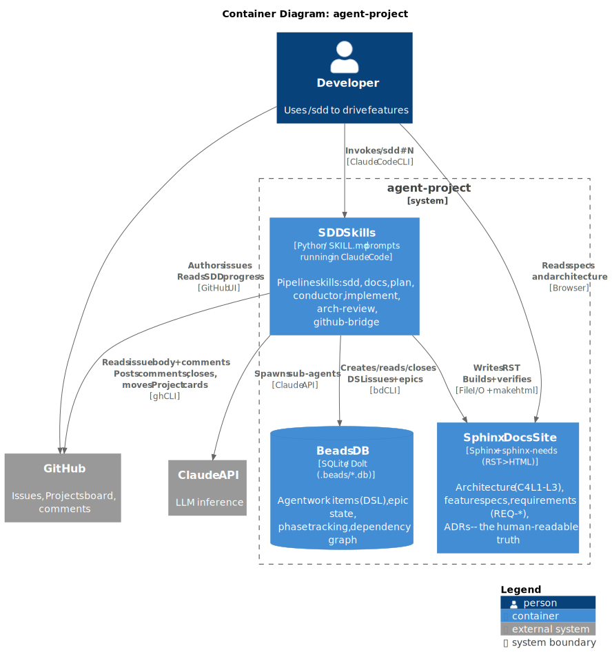

Containers
==========

The system boundary contains three logical containers. Because the plugin
runs inside Claude Code (not as a deployed service), "containers" here map
to distinct runtime contexts and storage layers rather than Docker images
or cloud services.

Elements
--------

.. list-table::
   :header-rows: 1
   :widths: 20 20 20 40

   * - Name
     - Type
     - Technology
     - Purpose
   * - SDD Skills
     - Application
     - Python / SKILL.md prompts running in Claude Code
     - All pipeline logic: SDD orchestrator, GitHub Bridge, Docs skill,
       Plan skill, Conductor, Implement workers, Arch-Review. This is the
       active part of the system — everything that reads, decides, and writes.
   * - Beads DB
     - Data Store
     - SQLite / Dolt (``.beads/*.db``)
     - Persistent agent-facing state: DSL task issues, epic phase label,
       dependency graph, run ID, reset counter. The bd CLI is the only
       interface — no direct SQL access.
   * - Sphinx Docs Site
     - Application / Data Store
     - Sphinx + sphinx-needs (RST → HTML)
     - Human-readable source of truth: C4 architecture docs (L1–L3),
       feature specs with ``feat`` / ``req`` directives, ADRs. Built by
       the Docs skill; read by the user and by Plan (to populate task briefs)
       and Arch-Review (to check REQ coverage and C4 boundaries).

Key Relationships
-----------------

- **SDD Skills → Beads DB**: All pipeline state mutations go through the
  ``bd`` CLI. The skills create the epic, update the ``phase=`` label, create
  task issues with DSL bodies, and close them on completion.
- **SDD Skills → Sphinx Docs Site**: The Docs skill writes ``.rst`` and
  ``.puml`` files, then builds via ``make html`` to verify zero errors.
  Plan reads the C4 L3 component narratives to populate ``[component]``
  blocks in bd task briefs.
- **SDD Skills → GitHub**: Via ``gh`` CLI. On invocation, the GitHub Bridge
  fetches the source issue. On phase transitions, it posts comments and
  (on done) closes the issue.
- **SDD Skills → Claude API**: The orchestrator spawns sub-agent invocations
  for each pipeline phase. Each sub-agent reads its SKILL.md and operates
  with its own context window.

Assumptions
-----------

- One Beads DB per repository (auto-discovered from ``.beads/``).
- One Sphinx docs site per repository (``docs/``).
- The ``gh`` CLI is pre-authenticated. If not, the GitHub Bridge surfaces a
  clear error with the command to run (``gh auth login``).
- GitHub Projects integration is conditional: the Bridge checks for a linked
  project before attempting card moves and skips silently if none exists.
