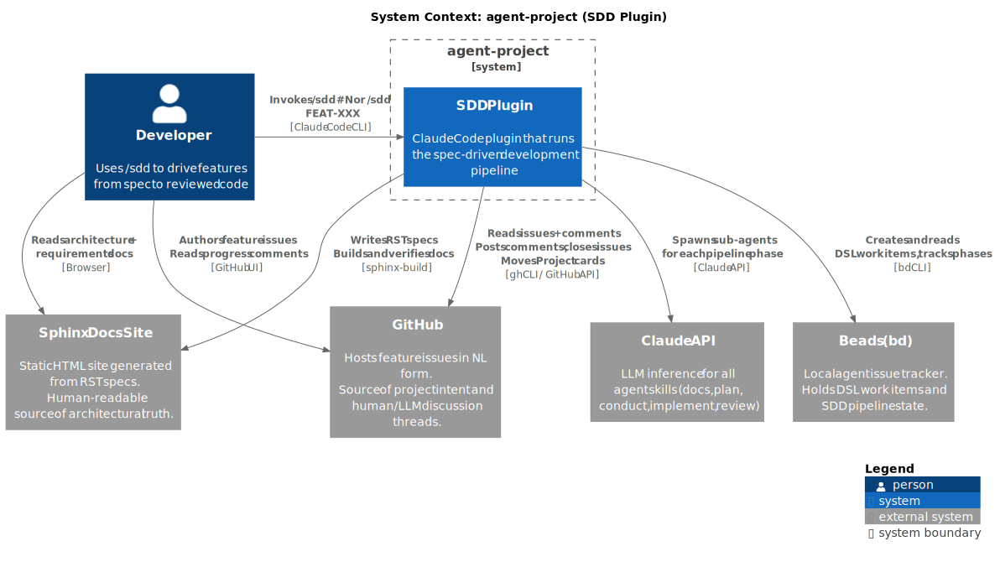

System Context
==============

The **agent-project** is a Claude Code plugin that implements Spec-Driven
Development (SDD). Developers invoke it via ``/sdd`` to drive a feature from
a natural-language specification all the way to reviewed, tested code — without
manually managing the intermediate steps.

Elements
--------

.. list-table::
   :header-rows: 1
   :widths: 20 15 65

   * - Name
     - Type
     - Purpose
   * - Developer
     - Person
     - Authors feature intent in GitHub Issues; invokes ``/sdd #N`` to start
       the pipeline; approves three gates (docs, plan, arch-review).
   * - agent-project (SDD Plugin)
     - System
     - Runs the SDD pipeline inside Claude Code. Reads GitHub for intent,
       manages DSL work items in Beads, writes RST specs to Sphinx, spawns
       Claude sub-agents for each phase.
   * - GitHub
     - External System
     - Source of project intent. Feature issues are written in natural language
       by the developer (and evolve via human/LLM comments). SDD reads issues
       as the opening brief for the docs phase and posts progress back.
   * - Beads (bd)
     - External System
     - Local agent issue tracker. Holds DSL task briefs, tracks the SDD epic
       phase, and maintains the dependency graph between agent work items.
   * - Claude API
     - External System
     - LLM inference for all pipeline phases. SDD spawns sub-agents (docs,
       plan, conductor, implement, arch-review) as Claude API calls.
   * - Sphinx Docs Site
     - External System
     - Static HTML site built from RST. The human-readable source of
       architectural truth: C4 diagrams, feature specs, REQ directives, ADRs.

Key Relationships
-----------------

- Developer invokes the plugin via ``/sdd #N`` (GitHub issue number) or
  ``/sdd FEAT-XXX`` (feature ID) in the Claude Code CLI.
- The plugin reads the GitHub issue body and all comments (with timestamps)
  to give the docs skill a starting brief instead of asking the user to
  re-explain what is already written.
- Beads holds all pipeline state. The bd epic's ``phase=`` label is the
  single source of truth for where the pipeline is.
- The docs skill writes RST files and builds Sphinx to verify them. The
  Sphinx docs site is the artifact the user approves at the first gate.
- On plan approval and on pipeline completion, the plugin posts comments to
  and (on done) closes the originating GitHub issue.

Constraints
-----------

- The plugin runs entirely inside the Claude Code runtime — no server, no
  deployed service.
- Beads is local (SQLite/Dolt); it is not a shared service.
- GitHub interaction uses the ``gh`` CLI, which must be authenticated
  (``gh auth login``) before ``/sdd #N`` invocations.
