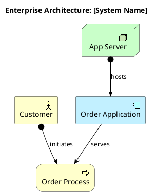

# Docs Skill

Guides architects and developers through structured documentation of a system
or feature. Produces a Sphinx site with C4 diagrams and sphinx-needs
requirements. All content is written in **reStructuredText (.rst)**.

Read `skills/rules/RULES.md` before starting.

---

## Workflow

```
1. BOOTSTRAP   — set up ./docs/ Sphinx + sphinx-needs site (idempotent)
2. SCOPE       — determine what to document (architecture level, feature, ADR)
3. INTERVIEW   — structured questions, one or two at a time
4. WRITE       — diagrams (.puml), RST pages, sphinx-needs directives
5. RENDER      — generate SVG from all .puml files
6. BUILD       — sphinx-build to verify no errors
7. GATE        — present docs to user; wait for explicit approval before advancing
```

Never skip step 7. The user must read and approve before the sdd pipeline advances.

---

## Step 1 — Bootstrap

Check whether `./docs/conf.py` exists. If not, run:

```bash
python <skill-path>/scripts/bootstrap_sphinx.py
pip install -r docs/requirements.txt
```

If `./docs/conf.py` already exists, verify `sphinxcontrib.needs` is in
`extensions`. If not, add it and add the `needs_types` and `needs_extra_options`
blocks from the bootstrap script's `CONF_PY` template.

---

## Step 2 — Determine Scope

Ask the user (if not already specified by the sdd skill):

```
What do you need to document?
  1. System Context (C4 L1) — system + external actors/systems
  2. Containers (C4 L2)     — deployable units inside the boundary
  3. Components (C4 L3)     — internals of a specific container
  4. All C4 levels          — full top-down interview
  5. Feature + requirements — new feat/req directives for a feature
  6. ADR                    — architecture decision record
  7. ArchiMate view         — enterprise landscape
```

Read all existing `./docs/architecture/*.rst` and `./docs/specs/**/*.rst`
before asking — do not re-ask questions already captured.

---

## Step 3 — Interview

Conduct conversationally: one or two questions at a time. Confirm each answer
before moving on. Carry answers from higher levels into lower-level interviews.

### C4 Level 1: System Context

- What is the name and primary purpose of this system?
- Who are the human users (personas, roles)?
- What external systems does it integrate with or depend on?
- What external systems depend on it?
- What are the key business goals this system serves?
- Any important constraints (compliance, scale, latency, security)?

### C4 Level 2: Containers

Per container:
- What is this container's responsibility?
- What technology stack / runtime?
- How is it deployed (Docker, VM, serverless, managed service)?
- What interfaces does it expose (REST, gRPC, queue, event bus)?
- What data does it own?
- What calls it, and what does it call?

### C4 Level 3: Components

Per component within a container:
- What is this component's single responsibility?
- What interfaces or ports does it implement?
- What are its dependencies within the container?
- What business rules or algorithms live here?
- What data structures / entities does it own or transform?
- What patterns does it use (Repository, CQRS, Factory, etc.)?

**Note**: the component description at L3 is the primary implementation guide.
Write it with enough detail that an agent can make correct design decisions
without reading the code. Include: pattern choices, ownership boundaries,
what the component is NOT responsible for.

### Feature + Requirements Interview

When documenting a new feature:

- What is the feature name and user-facing purpose?
- What is the feature ID (`FEAT-<NAME>`, all caps)?
- For each requirement:
  - What observable behaviour does the system exhibit?
  - Why does this requirement exist (rationale, business driver)?
  - What is the testable acceptance criterion?
  - What does this requirement explicitly NOT cover (non_goal)?
  - Which C4 L3 component owns this requirement (`c4_component`)?
  - Which C4 L2 container does that component live in (`c4_container`)?

A requirement is not ready until all six fields are answered.

### ADR Interview

- What decision was made?
- What was the context and the forces at play?
- What alternatives were considered and why were they rejected?
- What are the consequences (positive and negative)?
- Status: proposed | accepted | deprecated | superseded

---

## Step 4 — Write Content

### Feature and Requirements

File: `./docs/specs/features/<feature-name>.rst`

```rst
Feature Name
============

.. feat:: Feature Name
   :id: FEAT-NAME
   :status: draft|approved

   One paragraph describing the feature from the user's perspective.

Requirements
------------

.. req:: Requirement title
   :id: REQ-NAME-001
   :links: FEAT-NAME
   :status: draft|approved
   :rationale: Why this requirement exists.
   :acceptance: Given X, when Y, then Z.
   :non_goal: What this explicitly does not cover.
   :c4_component: component_id
   :c4_container: container_id

   The system shall [behaviour]. A falsifiable statement of observable
   system behaviour.
```

Add the new file to `./docs/specs/features/index.rst` toctree.

### ADR

File: `./docs/specs/adrs/adr-<NNN>-<slug>.rst`

```rst
ADR-NNN: Decision Title
=======================

.. adr:: Decision Title
   :id: ADR-NNN
   :status: accepted

   **Context**: Situation and forces at play.

   **Decision**: The decision, stated clearly.

   **Rationale**: Why this option over the alternatives.

   **Consequences**: What becomes easier or harder.

   **Alternatives considered**:

   - Option A — rejected because …
   - Option B — rejected because …
```

Add to `./docs/specs/adrs/index.rst` toctree.

### C4 — System Context

File: `./docs/architecture/diagrams/context.puml`

```plantuml
@startuml context
!include https://raw.githubusercontent.com/plantuml-stdlib/C4-PlantUML/master/C4_Context.puml

title System Context: [System Name]

Person(user, "[Role]", "[Description]")
System_Boundary(sys, "[System Name]") {
    System(core, "[System Name]", "[Purpose]")
}
System_Ext(ext1, "[External System]", "[Purpose]")

Rel(user, core, "[Interaction]", "[Protocol]")
Rel(core, ext1, "[Interaction]", "[Protocol]")

SHOW_LEGEND()
@enduml
```

RST page: `./docs/architecture/context.rst` — include the rendered SVG.

### C4 — Containers

File: `./docs/architecture/diagrams/containers.puml`

```plantuml
@startuml containers
!include https://raw.githubusercontent.com/plantuml-stdlib/C4-PlantUML/master/C4_Container.puml

title Container Diagram: [System Name]

Person(user, "[Role]", "[Description]")

System_Boundary(sys, "[System Name]") {
    Container(app, "[App Name]", "[Tech]", "[Responsibility]")
    ContainerDb(db, "[DB Name]", "[Tech]", "[What it stores]")
    ContainerQueue(q, "[Queue Name]", "[Tech]", "[Purpose]")
}

System_Ext(ext, "[External]", "[Purpose]")

Rel(user, app, "[How]", "[Protocol]")
Rel(app, db, "[How]", "SQL")
Rel(app, q, "publishes", "AMQP")
Rel(app, ext, "[How]", "[Protocol]")

SHOW_LEGEND()
@enduml
```

### C4 — Components (one file per container)

File: `./docs/architecture/diagrams/components_<container>.puml`

```plantuml
@startuml components_[container]
!include https://raw.githubusercontent.com/plantuml-stdlib/C4-PlantUML/master/C4_Component.puml

title Component Diagram: [Container Name]

Container_Boundary(app, "[Container Name]") {
    Component(comp1, "[Component]", "[Tech]", "[Responsibility]")
    Component(comp2, "[Component]", "[Tech]", "[Responsibility]")
    ComponentDb(repo, "[Repository]", "[Tech]", "[What it persists]")
}

Rel(comp1, comp2, "[How]", "[Protocol]")
Rel(comp2, repo, "reads/writes", "SQL")

SHOW_LEGEND()
@enduml
```

RST page: `./docs/architecture/components/<container-name>.rst`

**Write the component narrative section with care.** This is what plan reads to
populate `[component]` in bd tasks. For each component include:
- Single responsibility statement
- Patterns used (Repository, CQRS, etc.)
- What the component owns vs. delegates
- Key interfaces (what it exposes and what it consumes)
- What it explicitly does NOT do

### ArchiMate — Enterprise View

File: `./docs/architecture/diagrams/archimate_<view>.puml`



---

## Step 5 — Render Diagrams

```bash
python <skill-path>/scripts/generate_diagrams.py
```

If plantuml is not on PATH, the script prints installation instructions. Fix
before continuing.

---

## Step 6 — Build Verify

```bash
cd docs && make html 2>&1 | tail -30
```

Common failures:

| Error | Fix |
|---|---|
| `toctree contains reference to nonexistent document` | Add file or remove from toctree |
| `image file not readable` | Run `generate_diagrams.py` |
| `Title underline too short` | Underline must be ≥ title length |
| `Unknown directive type "req"` | `sphinxcontrib.needs` not in extensions |
| `Duplicate ID` | IDs must be unique across all RST files |

Report the output path on success: `docs/_build/html/index.html`

---

## Step 7 — User Approval Gate (mandatory)

Present a summary of what was written:

```
## Docs complete

**Written**:
- [list of files created or updated]

**Requirements captured** (if applicable):
- FEAT-XXX: N requirements, all fields complete
- REQ-XXX-NNN through REQ-XXX-NNN: all mapped to C4 components

**Build**: docs/_build/html/index.html — N warnings, 0 errors

Please review the documentation. When you are satisfied:
- Type **approve** to advance to the next phase
- Type **revise [what]** to continue editing
```

**Do not advance until the user explicitly approves.** This is not optional.

---

## Reset Signal

If during the interview or writing you discover a requirement that was implied
by prior discussion but is not yet captured, do NOT invent it silently. Surface
it:

```
New requirement identified: [description]
This needs to be captured before we can continue.
Shall I add it to the docs? This will be part of the approval gate.
```

If sdd called this skill and a new requirement was found mid-flow, sdd must be
notified so the reset counter is incremented on the epic.

---

## File Layout Reference

```
./docs/
├── conf.py                                  # Sphinx + sphinx-needs config
├── index.rst                                # Root TOC
├── Makefile
├── requirements.txt                         # sphinx + furo + sphinx-needs
├── about.rst
├── _static/
├── _templates/
├── architecture/
│   ├── index.rst
│   ├── context.rst                          # C4 L1
│   ├── containers.rst                       # C4 L2
│   ├── components/
│   │   └── <container-name>.rst             # C4 L3, one per container
│   └── diagrams/
│       ├── context.puml / context.svg
│       ├── containers.puml / containers.svg
│       ├── components_<name>.puml / .svg
│       └── archimate_<view>.puml / .svg
└── specs/
    ├── index.rst                            # Traceability matrix (needtable)
    ├── features/
    │   ├── index.rst
    │   └── <feature-name>.rst               # feat + req directives
    └── adrs/
        ├── index.rst
        └── adr-<NNN>-<slug>.rst
```

---

## See Also

- `scripts/bootstrap_sphinx.py` — idempotent site setup
- `scripts/generate_diagrams.py` — renders .puml → .svg
- `references/c4_archimate_guide.rst` — C4 and ArchiMate element reference
